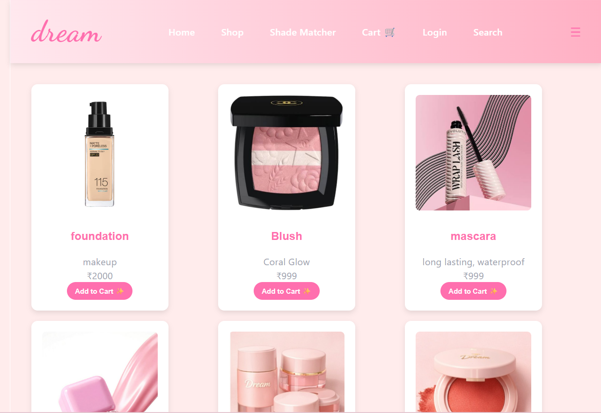
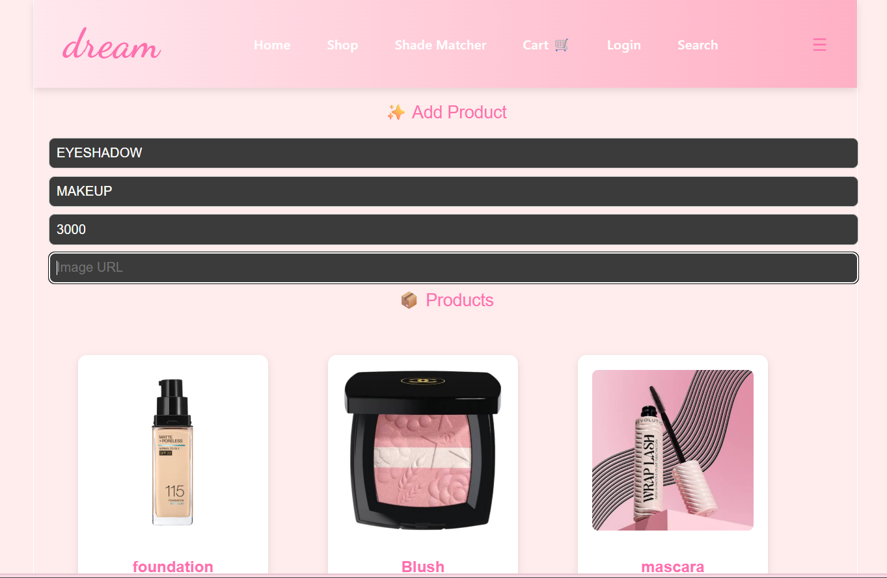

# Dream – E‑Commerce Makeup Website (Demo)

A demo React project simulating an online makeup store.  
Includes Supabase integration for product management (CRUD) and a responsive product grid layout.
Built for internship practice with a pastel aesthetic, responsive UI, and multiple reusable components.  
Note: This is a practice/demo website, not a real business.
---
## Features
- Elegant homepage with pastel gradient aesthetic
- Responsive design for desktop and mobile
- Clean **Navbar** with navigation links
- Eye‑catching **Hero Section** with tagline
- Promotional **Banner** for offers
- Organized **Categories** section (Lipsticks, Skincare, etc.)
- Dynamic **Featured Products** with demo catalog
- Highlighted **Perfect Section** (foundation shades showcase)
- Interactive **Product Cards** with fake names, prices, images
- Functional **Cart UI** (static demo with items added)
- Simple **Login Form** (email + password)
- Engaging **Testimonials** section with customer reviews
- Contact Form for user queries
- Professional **Footer** with links and socials
- Full CRUD functionality (Create, Read, Update, Delete products via Supabase)
- Unified product listing (Supabase + local assets)
- Responsive 3‑column grid layout for products
- Hover effects on product cards for interactive UI
---
## Tech Stack
- React (Frontend framework)
- React Router (Navigation)
- JavaScript (ES6+)
- CSS3 (Flexbox / Grid)
- Node.js & npm
- Supabase (PostgreSQL + Auth)

---
## Preview

### Homepage

### Shop

### Search

### Category

### Shade Matcher

### Cart

### Testimonials & Footer

### Contact

### Featured

---
## Future Enhancements
AI‑powered shade matcher for foundation

Real product catalog integration

Secure login & authentication

Payment gateway simulation

Wishlist & order tracking

Filter toggle (Supabase only / Local only / All)

---
# Clone repository
git clone https://github.com/dhanalakshmi-achar/dream-makeup-demo.git

# Navigate to project folder
cd dream-makeup-demo

# Install dependencies
npm install

# Start development server
run dev

---
### Author
Dhanalakshmi

Skills: React (Beginner), Frontend UI Design, JavaScript basics
